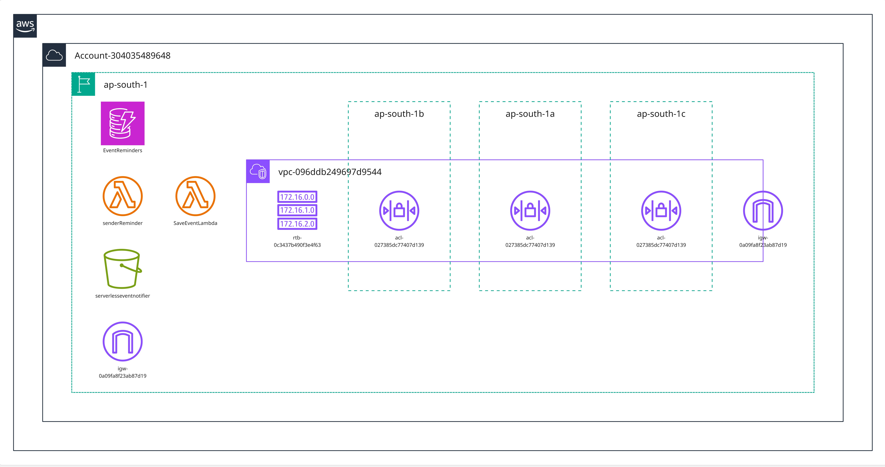
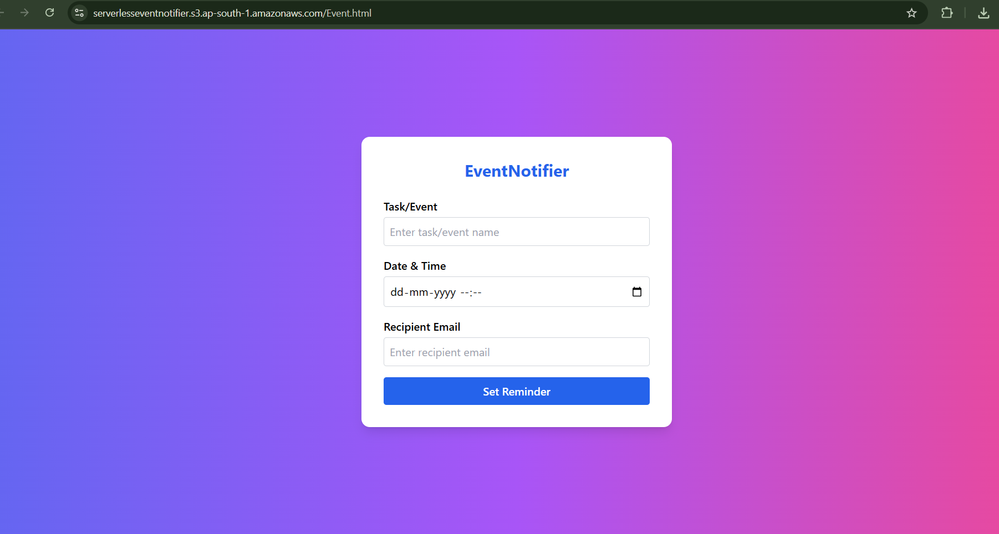

# Serverless EventNotifier

A serverless cloud application for scheduling and managing event/task reminders with automated email notifications via AWS SES.

---

## Features

- *AWS S3*: Static website hosting for the user interface  
- *AWS Lambda*: Serverless backend to process reminder logic  
- *API Gateway*: REST API for the frontend to submit event or task details  
- *DynamoDB*: Stores scheduled events and user data like title, date&time, email  
- *EventBridge*: Triggers Lambda every 5 minutes for timely notifications  
- *Amazon SES*: Sends opt-in email reminders to users  

---

## Architecture

The app is designed using fully managed AWS services for scalability, security, and zero server maintenance.

- Users submit reminders via a simple UI
- API Gateway receives form data and invokes Lambda
- Lambda stores details in DynamoDB and handles notification scheduling
- EventBridge periodically triggers Lambda to check and send due reminders
- Amazon SES delivers email notifications

---

## How to Deploy

1. *Frontend:*  
   - Upload HTML, CSS, JS files to an S3 bucket  
   - Enable S3 static website hosting

2. *Backend & Reminders:*  
   - Deploy Lambda functions via AWS Console or CLI  
   - Create REST API in API Gateway, connect it to Lambda  
   - Enable CORS for the API

3. *Database:*  
   - Set up a DynamoDB table for storing events

4. *Automated Reminders:*  
   - Create an EventBridge rule with schedule expression (e.g., rate(5 minutes))
   - Target: Reminder Lambda Function

5. *Email Delivery:*  
   - Set up SES(sandbox mode), verify sender email/domain, reciever email  
   - Update Lambda to use SES for sending emails

---

## Usage

- Visit the hosted S3 website
- Fill the form to schedule an event reminder
- Receive an automated email before 15 mintues of  scheduled time
- Note: User's email must be verified in AWS SES(sandbox mode) for recieving the reminder mail

---

## Screenshots

## Architecture

##Project-UI

##Sample Reminder Mail

